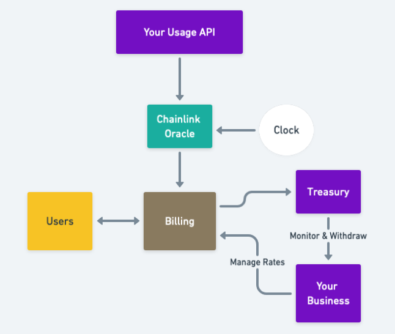

# AnyRate

AnyRate provides a cost-efficient and intuitive interface to use the blockchain ecosystem for payments through templates.

## Inspiration

It is hard for businesses to generate their own smart contracts for billing. Although businesses already have the data, they lack the technical expertise to generate smart contracts and manage the whole billing process that is taking place in and around the blockchain system.

Instead of manually generating specialized smart contracts for each customer/use-cases, there must be a better way!

Blockchains can provide automated billing that is less expensive and more secure than current processing & banking systems, and it is totally transparent.

## What it does

Business can use the app to create easily create and deploy smart contracts that store different billing parameters to bill their customers. Business can also manage their on-chain treasury through the app.

Customers can see their current usage for a business that they're a customer of. It can also help them manage their on-chain balances.

AnyRate Admin can charge the Business a fee for its service and also help Business bill their customers.

This comprehensive system have the following interfaces:

1. Business - Create Billing Form
2. Business - Treasury Management
3. Customer
4. AnyRate Admin
